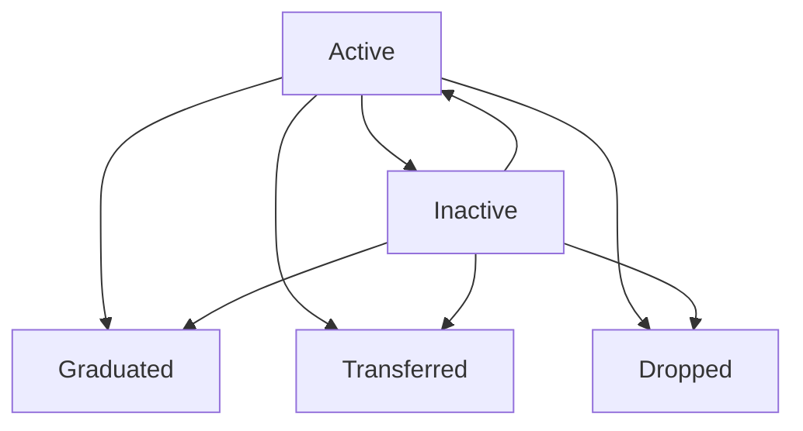

# Student Management System

## Overview

The student management module handles comprehensive student information, enrollment, and academic tracking throughout their educational journey.

## Student Information Structure

### 2.1 Personal Details

| Field | Type | Description | Required |
|-------|------|-------------|----------|
| `student_id` | BigInt | Unique identifier (Primary Key) | Yes |
| `first_name` | String(100) | Student's first name | Yes |
| `last_name` | String(100) | Student's last name | Yes |
| `date_of_birth` | Date | Birth date | Yes |
| `gender` | Enum | Male, Female, Other | Yes |
| `blood_group` | String(5) | Blood group (A+, B-, etc.) | No |
| `religion` | String(50) | Religious affiliation | No |
| `caste` | String(50) | Caste information | No |
| `nationality` | String(50) | Default: 'Nepali' | Yes |
| `mother_tongue` | String(50) | Primary language | No |
| `photo_url` | String(255) | Profile photo path | Required |

**Photo Requirements:**
- Stored in `storage/student-photos/`
- Supported formats: JPG, PNG
- Maximum size: 2MB
- Recommended dimensions: 300x400px

### 2.2 Contact Information

| Field | Type | Description | Required |
|-------|------|-------------|----------|
| `phone` | String(15) | Primary contact number | Yes |
| `email` | String(100) | Email address | No |
| `address` | Text | Permanent address | Yes |
| `temporary_address` | Text | Current residence (if different) | No |

### 2.3 Emergency Contact

| Field | Type | Description | Required |
|-------|------|-------------|----------|
| `emergency_contact_name` | String(100) | Emergency contact person | No |
| `emergency_contact_phone` | String(15) | Emergency contact number | No |
| `emergency_contact_relation` | String(20) | Relationship to student | No |

### 2.4 Guardian Information

| Field | Type | Description | Required |
|-------|------|-------------|----------|
| `guardian_name` | String(100) | Guardian's full name | Yes |
| `guardian_relation` | String(20) | Father, Mother, Guardian | Yes |
| `guardian_phone` | String(15) | Guardian's contact number | Yes |
| `guardian_email` | String(100) | Guardian's email | No |

### 2.5 Legal Documentation

| Field | Type | Description | Required |
|-------|------|-------------|----------|
| `citizenship_number` | String(20) | Citizenship certificate number | Optional |
| `citizenship_issue_date` | Date | Date of citizenship issuance | No |
| `citizenship_issue_district` | String(50) | Issuing district | No |
| `citizenship_document` | String(255) | Scanned document path | No |

**\*Citizenship Requirement:** Only required if student age ≥ 16 years

### 2.6 Academic History

| Field | Type | Description | Required |
|-------|------|-------------|----------|
| `previous_school_name` | String(150) | Previous educational institution | No |
| `transfer_certificate_no` | String(50) | TC number from previous school | No |
| `transfer_certificate_date` | Date | TC issue date | No |
| `migration_certificate_no` | String(50) | For +2/Bachelor programs | No |

### 2.7 Special Needs & Accessibility

| Field | Type | Description | Required |
|-------|------|-------------|----------|
| `disability_status` | Enum | none, visual, hearing, mobility, learning, other | Yes |
| `special_needs` | Text | Detailed requirements | No |

**Examples of Special Needs:**
- "Extra time in exams"
- "Wheelchair access required"
- "Large print materials"
- "Sign language interpreter"

### 2.8 Admission Information

| Field | Type | Description | Required |
|-------|------|-------------|----------|
| `admission_number` | String(20) | Permanent unique ID (e.g., ADM-2078-001) | Yes |
| `admission_date` | Date | First enrollment date | Yes |
| `status` | Enum | active, inactive, graduated, transferred, dropped | Yes |

## Student Enrollment System

### Annual Enrollment Process

Student enrollment is managed through the `student_enrollments` table, which tracks yearly academic progress:

| Field | Type | Description |
|-------|------|-------------|
| `student_id` | BigInt | Foreign key to students table |
| `academic_year_id` | BigInt | Academic year (e.g., 2081, 2082) |
| `class_id` | BigInt | Class assignment (e.g., Class 9, BCA1) |
| `program_id` | BigInt | Academic program (Science, BCA, BBS) |
| `roll_no` | String(10) | Auto-generated roll number |
| `section` | String(5) | Class section (A, B, C, etc.) |
| `enrollment_date` | Date | Enrollment date for current year |
| `status` | Enum | active, dropped, transferred |
| `academic_standing` | Enum | good, probation, repeat, dismissed |
| `backlog_count` | Integer | Number of failed subjects carried forward |

### Roll Number Generation

Roll numbers are automatically generated using the following format:

- **School Level:** `[Class][Section]-[Number]` (e.g., 9A-01, 10B-15)
- **College Level:** `[Class][Section]-[Number]` (e.g., 11A-08, 12B-22)
- **Bachelor Level:** `[Program][Year]-[Number]` (e.g., BCA1-005, BBS2-012)

### Academic Standing Definitions

| Status | Description | Action Required |
|--------|-------------|-----------------|
| **Good** | Meeting all academic requirements | None |
| **Probation** | Below minimum GPA but passing | Academic counseling |
| **Repeat** | Failed year, must repeat | Re-enrollment in same class |
| **Dismissed** | Multiple failures or disciplinary | Administrative review |

## Subject Enrollment

### Flexible Subject Assignment

The `student_subjects` table allows for flexible subject enrollment:

```sql
CREATE TABLE student_subjects (
    id BIGINT PRIMARY KEY,
    student_enrollment_id BIGINT,
    subject_id BIGINT,
    date_added DATE,
    status ENUM('active', 'dropped') DEFAULT 'active'
);
```

### Use Cases

1. **Mid-year Subject Changes**
   - Student switches from Science to Management
   - Additional subject enrollment
   - Subject dropping due to schedule conflicts

2. **Extra Classes**
   - Optional subjects
   - Remedial classes
   - Advanced placement courses

3. **Program Transfers**
   - Internal program changes
   - Cross-department enrollment

## Document Management

### Supported Document Types

| Document Type | Code | Description | Required |
|---------------|------|-------------|----------|
| Citizenship | `citizenship` | Citizenship certificate | Age ≥ 16 |
| Birth Certificate | `birth_cert` | Official birth certificate | Recommended |
| Transfer Certificate | `transfer_cert` | From previous school | Transfer students |
| Migration Certificate | `migration` | For higher education | College/Bachelor |
| Photo | `photo` | Student photograph | Yes |
| Other | `other` | Additional documents | As needed |

### Document Storage Structure

```
storage/
├── student-documents/
│   ├── {student_id}/
│   │   ├── citizenship/
│   │   ├── certificates/
│   │   ├── photos/
│   │   └── other/
```

### Document Verification Workflow

1. **Upload** - Teacher/Admin uploads document
2. **Review** - Admin reviews document authenticity
3. **Verify** - Mark as verified in system
4. **Link** - Associate with student profile

## Student Status Management

### Status Transitions



### Status Definitions

- **Active:** Currently enrolled and attending
- **Inactive:** Temporarily not attending (medical leave, etc.)
- **Graduated:** Successfully completed program
- **Transferred:** Moved to another institution
- **Dropped:** Discontinued studies

## Data Validation Rules

### Required Field Validation

- All personal details marked as required must be provided
- Photo upload is mandatory for all students
- Guardian information is required for students under 18
- Citizenship required for students 16 and above

### Business Logic Validation

- Admission date cannot be in the future
- Date of birth must result in reasonable age for class level
- Roll numbers must be unique within class/year combination
- Email addresses must be unique if provided

### Data Integrity Constraints

- Unique constraint on `admission_number`
- Unique constraint on `(student_id, academic_year_id)` in enrollments
- Unique constraint on `(class_id, academic_year_id, roll_no)` in enrollments
- Foreign key constraints maintain referential integrity

---

*This document outlines the comprehensive student management system designed to handle all aspects of student information, enrollment, and academic tracking.*
