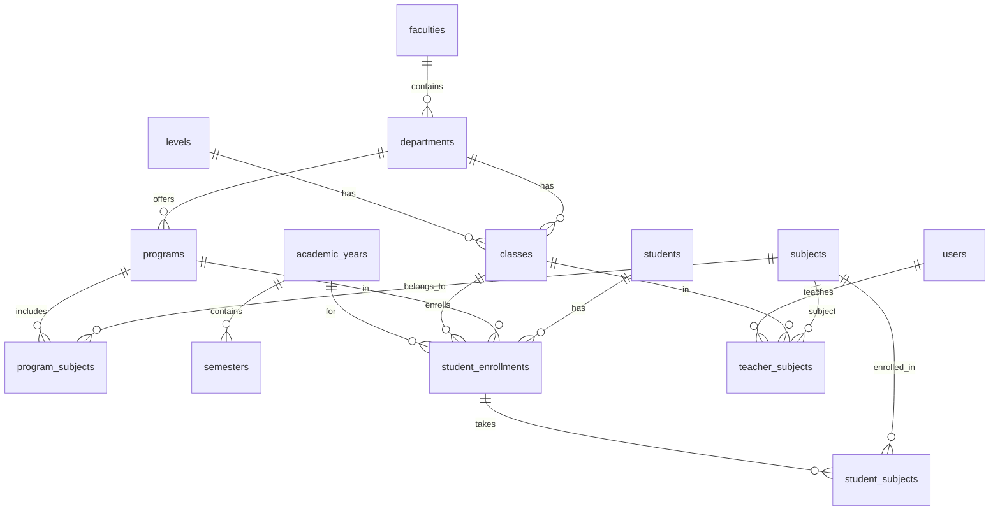

# Database Schema Documentation

## Overview

The Academic Management System uses a comprehensive database schema designed to handle multi-level educational institutions with flexible academic structures.

## Core Tables Structure

### 1. Academic Hierarchy Tables

#### `levels`
Defines educational levels (School, College, Bachelor)

| Column | Type | Description |
|--------|------|-------------|
| `id` | BigInt | Primary key |
| `name` | String(50) | Level name (School, College, Bachelor) |
| `order` | Integer | Display order (1=School, 2=College, 3=Bachelor) |
| `created_at` | Timestamp | Record creation time |
| `updated_at` | Timestamp | Last update time |

#### `faculties`
Academic faculties within the institution

| Column | Type | Description |
|--------|------|-------------|
| `id` | BigInt | Primary key |
| `name` | String(100) | Faculty name (Faculty of Science, Management) |
| `code` | String(10) | Short code (FOS, FOM) |
| `created_at` | Timestamp | Record creation time |
| `updated_at` | Timestamp | Last update time |

#### `departments`
Departments within faculties

| Column | Type | Description |
|--------|------|-------------|
| `id` | BigInt | Primary key |
| `faculty_id` | BigInt | Foreign key to faculties |
| `name` | String(100) | Department name |
| `code` | String(10) | Department code |
| `created_at` | Timestamp | Record creation time |
| `updated_at` | Timestamp | Last update time |

**Relationships:**
- `departments.faculty_id` → `faculties.id` (CASCADE DELETE)

#### `classes`
Class definitions across all levels

| Column | Type | Description |
|--------|------|-------------|
| `id` | BigInt | Primary key |
| `level_id` | BigInt | Foreign key to levels |
| `department_id` | BigInt | Foreign key to departments (nullable) |
| `name` | String(50) | Class name (Class 9, BCA1) |
| `code` | String(10) | Class code |
| `is_active` | Boolean | Active status |
| `created_at` | Timestamp | Record creation time |
| `updated_at` | Timestamp | Last update time |

**Relationships:**
- `classes.level_id` → `levels.id` (CASCADE DELETE)
- `classes.department_id` → `departments.id` (SET NULL)

#### `programs`
Academic programs offered

| Column | Type | Description |
|--------|------|-------------|
| `id` | BigInt | Primary key |
| `department_id` | BigInt | Foreign key to departments |
| `name` | String(100) | Program name (Science, BCA, BBS) |
| `duration_years` | Integer | Program duration |
| `degree_type` | Enum | school, college, bachelor |
| `created_at` | Timestamp | Record creation time |
| `updated_at` | Timestamp | Last update time |

**Relationships:**
- `programs.department_id` → `departments.id` (CASCADE DELETE)

### 2. Time Management Tables

#### `academic_years`
Academic year definitions

| Column | Type | Description |
|--------|------|-------------|
| `id` | BigInt | Primary key |
| `name` | String(10) | Year name (2081, 2082) |
| `start_date` | Date | Academic year start |
| `end_date` | Date | Academic year end |
| `is_current` | Boolean | Current active year |
| `created_at` | Timestamp | Record creation time |
| `updated_at` | Timestamp | Last update time |

**Constraints:**
- Unique constraint on `name`

#### `semesters`
Semester/term definitions

| Column | Type | Description |
|--------|------|-------------|
| `id` | BigInt | Primary key |
| `academic_year_id` | BigInt | Foreign key to academic_years |
| `name` | String(20) | Semester name (Semester 1, Yearly) |
| `start_date` | Date | Semester start |
| `end_date` | Date | Semester end |
| `order` | Integer | Semester order (1, 2) |
| `created_at` | Timestamp | Record creation time |
| `updated_at` | Timestamp | Last update time |

**Relationships:**
- `semesters.academic_year_id` → `academic_years.id` (CASCADE DELETE)

### 3. Subject Management Tables

#### `subjects`
Subject definitions

| Column | Type | Description |
|--------|------|-------------|
| `id` | BigInt | Primary key |
| `name` | String(100) | Subject name |
| `code` | String(10) | Subject code |
| `max_assess` | Integer | Maximum assessment marks |
| `max_theory` | Integer | Maximum theory marks |
| `max_practical` | Integer | Maximum practical marks |
| `is_practical` | Boolean | Has practical component |
| `has_internal` | Boolean | Has internal assessment |
| `created_at` | Timestamp | Record creation time |
| `updated_at` | Timestamp | Last update time |

#### `program_subjects`
Links subjects to programs with academic details

| Column | Type | Description |
|--------|------|-------------|
| `id` | BigInt | Primary key |
| `program_id` | BigInt | Foreign key to programs |
| `subject_id` | BigInt | Foreign key to subjects |
| `is_compulsory` | Boolean | Compulsory subject flag |
| `credit_hours` | Integer | Credit hours (nullable) |
| `semester_id` | BigInt | Foreign key to semesters (nullable) |
| `year_no` | Integer | Year number for yearly programs |
| `sort_order` | Integer | Display order |
| `created_at` | Timestamp | Record creation time |
| `updated_at` | Timestamp | Last update time |

**Relationships:**
- `program_subjects.program_id` → `programs.id` (CASCADE DELETE)
- `program_subjects.subject_id` → `subjects.id` (CASCADE DELETE)
- `program_subjects.semester_id` → `semesters.id` (SET NULL)

**Constraints:**
- Unique constraint on `(program_id, subject_id, semester_id, year_no)`

### 4. Grading System Tables

#### `grading_scales`
Configurable grading scales

| Column | Type | Description |
|--------|------|-------------|
| `id` | BigInt | Primary key |
| `name` | String(100) | Scale name (School 40% Pass) |
| `description` | Text | Detailed description |
| `pass_mark` | Integer | Minimum percentage to pass |
| `scale_type` | Enum | percentage, gpa, division |
| `grade` | String(5) | Grade symbol (A+, B) |
| `min_percentage` | Integer | Minimum percentage for grade |
| `max_percentage` | Integer | Maximum percentage for grade |
| `gpa` | Decimal(3,2) | GPA value |
| `applies_to_program_id` | BigInt | Specific program (nullable) |
| `applies_to_level_id` | BigInt | Specific level (nullable) |
| `is_active` | Boolean | Active status |
| `created_at` | Timestamp | Record creation time |
| `updated_at` | Timestamp | Last update time |

**Relationships:**
- `grading_scales.applies_to_program_id` → `programs.id` (SET NULL)
- `grading_scales.applies_to_level_id` → `levels.id` (SET NULL)

### 5. Student Tables

#### `students`
Complete student information

| Column | Type | Description |
|--------|------|-------------|
| `id` | BigInt | Primary key |
| `first_name` | String(100) | First name |
| `last_name` | String(100) | Last name |
| `date_of_birth` | Date | Birth date |
| `gender` | Enum | Male, Female, Other |
| `blood_group` | String(5) | Blood group |
| `religion` | String(50) | Religion |
| `caste` | String(50) | Caste |
| `nationality` | String(50) | Nationality |
| `mother_tongue` | String(50) | Mother tongue |
| `phone` | String(15) | Contact number |
| `email` | String(100) | Email address |
| `address` | Text | Permanent address |
| `temporary_address` | Text | Temporary address |
| `emergency_contact_name` | String(100) | Emergency contact |
| `emergency_contact_phone` | String(15) | Emergency phone |
| `emergency_contact_relation` | String(20) | Emergency relation |
| `guardian_name` | String(100) | Guardian name |
| `guardian_relation` | String(20) | Guardian relation |
| `guardian_phone` | String(15) | Guardian phone |
| `guardian_email` | String(100) | Guardian email |
| `citizenship_number` | String(20) | Citizenship number |
| `citizenship_issue_date` | Date | Citizenship issue date |
| `citizenship_issue_district` | String(50) | Issue district |
| `citizenship_document` | String(255) | Document path |
| `previous_school_name` | String(150) | Previous school |
| `transfer_certificate_no` | String(50) | TC number |
| `transfer_certificate_date` | Date | TC date |
| `migration_certificate_no` | String(50) | Migration certificate |
| `disability_status` | Enum | Disability type |
| `special_needs` | Text | Special requirements |
| `admission_number` | String(20) | Unique admission number |
| `admission_date` | Date | Admission date |
| `photo_url` | String(255) | Photo path |
| `status` | Enum | active, inactive, graduated, transferred, dropped |
| `created_at` | Timestamp | Record creation time |
| `updated_at` | Timestamp | Last update time |
| `deleted_at` | Timestamp | Soft delete timestamp |

**Constraints:**
- Unique constraint on `admission_number`
- Soft deletes enabled

#### `student_enrollments`
Yearly student enrollment records

| Column | Type | Description |
|--------|------|-------------|
| `id` | BigInt | Primary key |
| `student_id` | BigInt | Foreign key to students |
| `academic_year_id` | BigInt | Foreign key to academic_years |
| `class_id` | BigInt | Foreign key to classes |
| `program_id` | BigInt | Foreign key to programs |
| `roll_no` | String(10) | Roll number |
| `section` | String(5) | Class section |
| `enrollment_date` | Date | Enrollment date |
| `status` | Enum | active, dropped, transferred |
| `academic_standing` | Enum | good, probation, repeat, dismissed |
| `backlog_count` | Integer | Failed subjects count |
| `created_at` | Timestamp | Record creation time |
| `updated_at` | Timestamp | Last update time |

**Relationships:**
- `student_enrollments.student_id` → `students.id` (CASCADE DELETE)
- `student_enrollments.academic_year_id` → `academic_years.id` (CASCADE DELETE)
- `student_enrollments.class_id` → `classes.id` (CASCADE DELETE)
- `student_enrollments.program_id` → `programs.id` (CASCADE DELETE)

**Constraints:**
- Unique constraint on `(student_id, academic_year_id)`
- Unique constraint on `(class_id, academic_year_id, roll_no)`

#### `student_subjects`
Flexible student-subject enrollment

| Column | Type | Description |
|--------|------|-------------|
| `id` | BigInt | Primary key |
| `student_enrollment_id` | BigInt | Foreign key to student_enrollments |
| `subject_id` | BigInt | Foreign key to subjects |
| `date_added` | Date | Subject addition date |
| `status` | Enum | active, dropped |
| `created_at` | Timestamp | Record creation time |
| `updated_at` | Timestamp | Last update time |

**Relationships:**
- `student_subjects.student_enrollment_id` → `student_enrollments.id` (CASCADE DELETE)
- `student_subjects.subject_id` → `subjects.id` (CASCADE DELETE)

### 6. User Management Tables

#### `users` (Laravel Default)
System users with authentication

| Column | Type | Description |
|--------|------|-------------|
| `id` | BigInt | Primary key |
| `name` | String | Full name |
| `email` | String | Email (unique) |
| `email_verified_at` | Timestamp | Email verification |
| `password` | String | Hashed password |
| `remember_token` | String | Remember token |
| `created_at` | Timestamp | Record creation time |
| `updated_at` | Timestamp | Last update time |

#### `teacher_subjects`
Teacher-subject assignments

| Column | Type | Description |
|--------|------|-------------|
| `id` | BigInt | Primary key |
| `user_id` | BigInt | Foreign key to users (teacher) |
| `class_id` | BigInt | Foreign key to classes |
| `subject_id` | BigInt | Foreign key to subjects |
| `academic_year_id` | BigInt | Foreign key to academic_years |
| `is_active` | Boolean | Assignment status |
| `created_at` | Timestamp | Record creation time |
| `updated_at` | Timestamp | Last update time |

**Relationships:**
- `teacher_subjects.user_id` → `users.id` (CASCADE DELETE)
- `teacher_subjects.class_id` → `classes.id` (CASCADE DELETE)
- `teacher_subjects.subject_id` → `subjects.id` (CASCADE DELETE)
- `teacher_subjects.academic_year_id` → `academic_years.id` (CASCADE DELETE)

**Constraints:**
- Unique constraint on `(user_id, class_id, subject_id, academic_year_id)`

## Database Relationships Diagram

### 7. Examination & Assessment Tables

#### `exams`
Examination definitions with flexible marking schemes

| Column | Type | Description |
|--------|------|-------------|
| `id` | BigInt | Primary key |
| `name` | String(100) | Exam name (Terminal Exam, Monthly Quiz) |
| `exam_type` | Enum | assessment, terminal, quiz, project, practical, final |
| `academic_year_id` | BigInt | Foreign key to academic_years |
| `semester_id` | BigInt | Foreign key to semesters (nullable) |
| `class_id` | BigInt | Foreign key to classes (nullable) |
| `program_id` | BigInt | Foreign key to programs (nullable) |
| `subject_id` | BigInt | Foreign key to subjects (nullable) |
| `grading_scale_id` | BigInt | Foreign key to grading_scales (nullable) |
| `max_marks` | Integer | Total maximum marks |
| `theory_max` | Integer | Theory component maximum |
| `practical_max` | Integer | Practical component maximum |
| `assess_max` | Integer | Assessment component maximum |
| `has_practical` | Boolean | Practical component flag |
| `submission_deadline` | DateTime | Mark submission deadline |
| `result_status` | Enum | draft, scheduled, ongoing, submitted, approved, published, locked |
| `is_locked` | Boolean | Edit lock status |
| `approval_date` | Timestamp | Principal approval date |
| `start_date` | Date | Exam start date |
| `end_date` | Date | Exam end date |
| `remarks` | Text | Additional notes |
| `created_by` | BigInt | Foreign key to users |
| `created_at` | Timestamp | Record creation time |
| `updated_at` | Timestamp | Last update time |

**Relationships:**
- `exams.academic_year_id` → `academic_years.id` (CASCADE DELETE)
- `exams.semester_id` → `semesters.id` (SET NULL)
- `exams.class_id` → `classes.id` (SET NULL)
- `exams.program_id` → `programs.id` (SET NULL)
- `exams.subject_id` → `subjects.id` (SET NULL)
- `exams.grading_scale_id` → `grading_scales.id` (SET NULL)
- `exams.created_by` → `users.id` (SET NULL)

#### `marks`
Student marks for examinations

| Column | Type | Description |
|--------|------|-------------|
| `id` | BigInt | Primary key |
| `student_id` | BigInt | Foreign key to students |
| `subject_id` | BigInt | Foreign key to subjects |
| `exam_id` | BigInt | Foreign key to exams |
| `assess_marks` | Decimal(5,2) | Assessment marks |
| `theory_marks` | Decimal(5,2) | Theory marks |
| `practical_marks` | Decimal(5,2) | Practical marks |
| `total` | Decimal(5,2) | Computed total (stored) |
| `percentage` | Decimal(5,2) | Percentage score |
| `grade` | String(5) | Letter grade (A+, B, etc.) |
| `gpa` | Decimal(3,2) | GPA value |
| `result` | Enum | Pass, Fail, Incomplete |
| `is_reexam` | Boolean | Re-examination flag |
| `original_exam_id` | BigInt | Original exam reference |
| `grace_marks` | Decimal(3,2) | Grace marks added |
| `carry_forward_reason` | Text | Reason for carry forward |
| `status` | Enum | draft, final |
| `created_by` | BigInt | Foreign key to users |
| `updated_by` | BigInt | Foreign key to users |
| `created_at` | Timestamp | Record creation time |
| `updated_at` | Timestamp | Last update time |

**Relationships:**
- `marks.student_id` → `students.id` (CASCADE DELETE)
- `marks.subject_id` → `subjects.id` (CASCADE DELETE)
- `marks.exam_id` → `exams.id` (CASCADE DELETE)
- `marks.original_exam_id` → `exams.id` (SET NULL)
- `marks.created_by` → `users.id` (SET NULL)
- `marks.updated_by` → `users.id` (SET NULL)

**Constraints:**
- Unique constraint on `(student_id, subject_id, exam_id)`

### 8. Audit & Logging Tables

#### `mark_logs`
Audit trail for mark changes

| Column | Type | Description |
|--------|------|-------------|
| `id` | BigInt | Primary key |
| `mark_id` | BigInt | Foreign key to marks |
| `field_name` | String(20) | Changed field name |
| `old_value` | Decimal(5,2) | Previous value |
| `new_value` | Decimal(5,2) | New value |
| `changed_by` | BigInt | Foreign key to users |
| `ip_address` | String(45) | User IP address |
| `user_agent` | Text | Browser information |
| `created_at` | Timestamp | Change timestamp |
| `updated_at` | Timestamp | Last update time |

**Relationships:**
- `mark_logs.mark_id` → `marks.id` (CASCADE DELETE)
- `mark_logs.changed_by` → `users.id` (CASCADE DELETE)

#### `activity_log`
System-wide activity logging

| Column | Type | Description |
|--------|------|-------------|
| `id` | BigInt | Primary key |
| `subject_type` | String(200) | Model class name |
| `subject_id` | BigInt | Model instance ID |
| `action` | String(50) | Action performed |
| `description` | Text | Action description |
| `user_id` | BigInt | Foreign key to users |
| `ip_address` | String(45) | User IP address |
| `user_agent` | Text | Browser information |
| `created_at` | Timestamp | Activity timestamp |
| `updated_at` | Timestamp | Last update time |

**Relationships:**
- `activity_log.user_id` → `users.id` (SET NULL)

**Indexes:**
- Index on `(subject_type, subject_id)`

### 9. System Configuration Tables

#### `institute_settings`
Institution configuration

| Column | Type | Description |
|--------|------|-------------|
| `id` | BigInt | Primary key |
| `school_name` | String(200) | Institution name |
| `school_name_np` | String(200) | Name in Nepali |
| `address` | Text | Institution address |
| `phone` | String(15) | Contact number |
| `email` | String(100) | Official email |
| `logo_path` | String(255) | Logo file path |
| `seal_path` | String(255) | Official seal path |
| `principal_name` | String(100) | Principal name |
| `principal_signature` | String(255) | Signature image path |
| `show_attendance` | Boolean | Show attendance in reports |
| `show_remarks` | Boolean | Show remarks in marksheets |
| `template_style` | Enum | modern, classic, minimal |
| `enable_grace_marks` | Boolean | Allow grace marks |
| `created_at` | Timestamp | Record creation time |
| `updated_at` | Timestamp | Last update time |

#### `backups`
Backup management

| Column | Type | Description |
|--------|------|-------------|
| `id` | BigInt | Primary key |
| `path` | String(500) | Backup file path |
| `size` | Integer | File size in KB |
| `type` | Enum | manual, auto |
| `created_by` | BigInt | Foreign key to users (nullable) |
| `created_at` | Timestamp | Backup timestamp |
| `updated_at` | Timestamp | Last update time |

#### `student_documents`
Student document management

| Column | Type | Description |
|--------|------|-------------|
| `id` | BigInt | Primary key |
| `student_id` | BigInt | Foreign key to students |
| `doc_type` | Enum | citizenship, birth_cert, transfer_cert, migration, photo, other |
| `file_path` | String(500) | Document file path |
| `uploaded_by` | BigInt | Foreign key to users |
| `is_verified` | Boolean | Verification status |
| `created_at` | Timestamp | Upload timestamp |
| `updated_at` | Timestamp | Last update time |

**Relationships:**
- `student_documents.student_id` → `students.id` (CASCADE DELETE)
- `student_documents.uploaded_by` → `users.id` (CASCADE DELETE)

---

*This comprehensive schema provides a flexible, scalable foundation for managing complex academic structures while maintaining data integrity and supporting real-world educational scenarios.*
