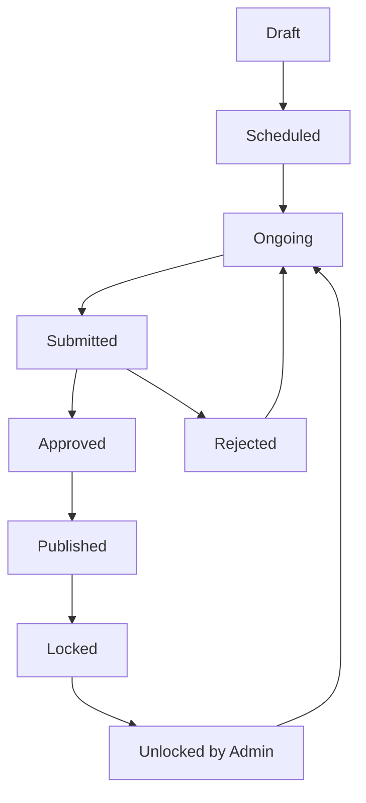

# Examination & Marking System

## Overview

The examination system provides flexible exam creation, mark entry, and result management with comprehensive workflow controls and audit trails.

## Examination Types

### Supported Exam Types

| Type | Code | Description | Use Case |
|------|------|-------------|----------|
| **Assessment** | `assessment` | Continuous assessment | Class tests, assignments |
| **Terminal** | `terminal` | Major examinations | Mid-term, final exams |
| **Quiz** | `quiz` | Short assessments | Weekly quizzes, pop tests |
| **Project** | `project` | Project-based evaluation | Research projects, presentations |
| **Practical** | `practical` | Hands-on evaluation | Lab work, skill demonstrations |
| **Final** | `final` | Final examinations | Year-end, board exams |

### Flexible Marking Schemes

The system supports various marking configurations:

#### Common Marking Patterns

1. **Theory Only (100 marks)**
   - `theory_max`: 100
   - `practical_max`: 0
   - `assess_max`: 0

2. **Theory + Practical (80+20)**
   - `theory_max`: 80
   - `practical_max`: 20
   - `assess_max`: 0

3. **Theory + Assessment (75+25)**
   - `theory_max`: 75
   - `practical_max`: 0
   - `assess_max`: 25

4. **Full Components (60+20+20)**
   - `theory_max`: 60
   - `practical_max`: 20
   - `assess_max`: 20

## Exam Creation Workflow

### 1. Exam Setup

```php
// Example exam creation
$exam = Exam::create([
    'name' => 'Terminal Examination 2081',
    'exam_type' => 'terminal',
    'academic_year_id' => $academicYear->id,
    'class_id' => $class->id,
    'max_marks' => 100,
    'theory_max' => 75,
    'practical_max' => 25,
    'has_practical' => true,
    'start_date' => '2081-10-01',
    'end_date' => '2081-10-15',
    'submission_deadline' => '2081-10-20 17:00:00',
    'created_by' => auth()->id()
]);
```

### 2. Exam Scoping

Exams can be scoped to different levels:

- **Institution-wide:** No specific class/program/subject
- **Program-specific:** Applies to all classes in a program
- **Class-specific:** Applies to specific class only
- **Subject-specific:** Single subject examination

### 3. Grading Scale Assignment

Each exam can use:
- **Default grading scale** for the level/program
- **Custom grading scale** specified during creation
- **Override grading scale** for special circumstances

## Result Status Workflow

### Status Progression



### Status Definitions

| Status | Description | Actions Available | Who Can Change |
|--------|-------------|-------------------|----------------|
| **Draft** | Initial creation | Edit, Delete | Admin |
| **Scheduled** | Ready for conduct | Start exam | Admin, Principal |
| **Ongoing** | Exam in progress | Enter marks | Teachers |
| **Submitted** | Marks submitted | Review, Approve/Reject | Principal |
| **Approved** | Principal approved | Publish results | Principal |
| **Published** | Results visible | View, Print | All users |
| **Locked** | No modifications | View only | Admin override only |

### Workflow Rules

1. **Teacher Permissions**
   - Can enter marks only for assigned subjects
   - Can modify marks only in "Ongoing" status
   - Must submit all marks before deadline

2. **Principal Permissions**
   - Can approve/reject submitted results
   - Can apply grace marks with reason
   - Can publish approved results

3. **Admin Permissions**
   - Can override any status
   - Can unlock published results
   - Can modify marks with audit trail

## Mark Entry System

### Mark Components

Each student's performance is recorded across multiple components:

```php
// Mark entry structure
$mark = Mark::create([
    'student_id' => $student->id,
    'subject_id' => $subject->id,
    'exam_id' => $exam->id,
    'assess_marks' => 18.5,      // Out of assess_max
    'theory_marks' => 65.0,      // Out of theory_max
    'practical_marks' => 22.0,   // Out of practical_max
    'status' => 'draft',
    'created_by' => auth()->id()
]);
```

### Automatic Calculations

The system automatically computes:

1. **Total Marks**
   ```php
   $total = $assess_marks + $theory_marks + $practical_marks;
   ```

2. **Percentage**
   ```php
   $percentage = ($total / $exam->max_marks) * 100;
   ```

3. **Grade & GPA**
   - Based on configured grading scale
   - Considers pass/fail thresholds
   - Handles grade boundaries

4. **Result Status**
   ```php
   $result = $percentage >= $gradingScale->pass_mark ? 'Pass' : 'Fail';
   ```

### Validation Rules

#### Mark Entry Validation

- Marks cannot exceed component maximums
- Negative marks not allowed
- Decimal precision limited to 2 places
- Required components must be entered

#### Business Logic Validation

- Students must be enrolled in subject
- Exam must be in "Ongoing" status
- Teacher must be assigned to subject
- Submission deadline must not be passed

## Grace Marks System

### Grace Marks Authorization

Only authorized users can apply grace marks:

- **Principal:** Up to 5 marks per subject
- **Admin:** Unlimited (with proper justification)

### Grace Marks Process

1. **Application**
   ```php
   $mark->update([
       'grace_marks' => 2.5,
       'grace_reason' => 'Borderline case - medical certificate provided'
   ]);
   ```

2. **Audit Trail**
   - All grace marks logged in `mark_logs`
   - Reason required for all applications
   - IP address and user agent recorded

3. **Display**
   - Grace marks shown separately on marksheets
   - Format: "Grace: +2.5"
   - Included in total calculations

### Common Grace Mark Scenarios

- **Borderline cases:** Student just below pass mark
- **Medical circumstances:** Illness during exam
- **Technical issues:** System problems during online components
- **Special considerations:** Disability accommodations

## Re-examination System

### Re-exam Triggers

Re-examinations are created for:

1. **Failed Students**
   - Automatic eligibility for failed subjects
   - Same marking scheme as original exam
   - Separate result tracking

2. **Absent Students**
   - Medical leave during exam
   - Emergency situations
   - Official absence approval

### Re-exam Process

```php
// Create re-exam
$reExam = Exam::create([
    'name' => 'Re-examination - Terminal 2081',
    'exam_type' => 'terminal',
    'is_reexam' => true,
    'original_exam_id' => $originalExam->id,
    // ... other fields
]);

// Link marks to original exam
$mark = Mark::create([
    'is_reexam' => true,
    'original_exam_id' => $originalExam->id,
    'carry_forward_reason' => 'Failed in original examination'
]);
```

## Bulk Operations

### Bulk Mark Entry

Teachers can enter marks for entire classes:

1. **Excel Import**
   - Template download with student list
   - Server-side validation on upload
   - Error reporting for corrections

2. **Traditional Form Entry**
   - Table-based mark entry interface
   - JavaScript-enhanced validation
   - Form submission with server-side processing

### Bulk Result Processing

Administrators can:

1. **Batch Approval**
   - Approve multiple subjects at once
   - Class-wise or program-wise approval
   - Bulk status updates

2. **Mass Grade Calculation**
   - Recalculate grades for grading scale changes
   - Batch GPA updates
   - Result status updates

## Mark Modification Audit

### Audit Trail Components

Every mark change is logged with:

```php
MarkLog::create([
    'mark_id' => $mark->id,
    'field_name' => 'theory_marks',
    'old_value' => 65.0,
    'new_value' => 67.5,
    'changed_by' => auth()->id(),
    'ip_address' => request()->ip(),
    'user_agent' => request()->userAgent(),
    'reason' => 'Calculation error correction'
]);
```

### Audit Reports

Administrators can generate:

- **Mark Change Reports:** All modifications in date range
- **User Activity Reports:** Changes by specific users
- **Subject-wise Reports:** Modifications for specific subjects
- **Suspicious Activity Reports:** Unusual patterns or bulk changes

## Performance Optimization

### Database Indexing

Key indexes for performance:

```sql
-- Mark lookup optimization
INDEX idx_marks_student_exam (student_id, exam_id);
INDEX idx_marks_subject_exam (subject_id, exam_id);

-- Audit trail optimization
INDEX idx_mark_logs_mark_id (mark_id);
INDEX idx_mark_logs_changed_by (changed_by);

-- Result status queries
INDEX idx_exams_status (result_status);
INDEX idx_exams_academic_year (academic_year_id);
```

### Caching Strategy

- **Grade calculations** cached per student/exam
- **Class statistics** cached and updated on mark changes
- **Grading scales** cached globally
- **User permissions** cached per session

---

*This examination system provides comprehensive functionality for managing all aspects of academic assessment while maintaining data integrity and providing complete audit trails.*
