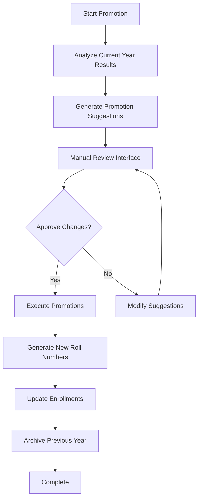
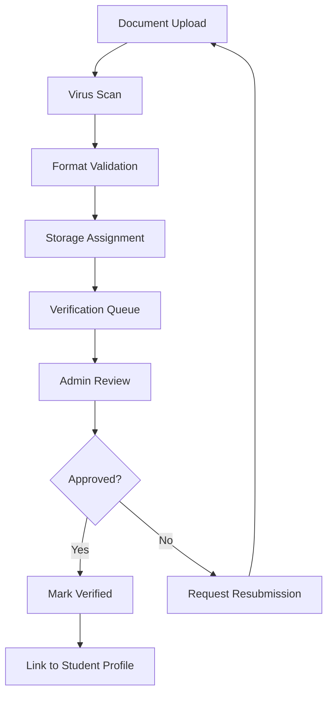

# System Features & Implementation

## Core Features

### 1. Setup Wizard

**Purpose:** Guide first-time administrators through initial system configuration.

#### Setup Process Flow

1. **Welcome & Requirements Check**
   - System requirements validation
   - Database connection verification
   - File permissions check

2. **Institution Information**
   ```php
   // Institution setup form
   $settings = [
       'school_name' => 'ABC Secondary School',
       'school_name_np' => 'एबीसी माध्यमिक विद्यालय',
       'address' => 'Kathmandu, Nepal',
       'phone' => '+977-1-4567890',
       'email' => 'info@abcschool.edu.np'
   ];
   ```

3. **Academic Year Configuration**
   - Current academic year setup
   - Semester/term definitions
   - Academic calendar configuration

4. **Default Grading Scale**
   - Grade boundaries setup
   - Pass/fail thresholds
   - GPA scale configuration

5. **Admin Account Creation**
   - Primary administrator account
   - Initial password setup
   - Role assignment

6. **System Finalization**
   - Configuration validation
   - Sample data creation (optional)
   - Dashboard redirect

### 2. Student Promotion Engine

**Purpose:** Automate yearly student progression with manual review capabilities.

#### Promotion Workflow



#### Promotion Logic

```php
class PromotionEngine
{
    public function generatePromotionSuggestions($academicYearId)
    {
        $students = StudentEnrollment::where('academic_year_id', $academicYearId)
            ->with(['student', 'marks'])
            ->get();

        foreach ($students as $enrollment) {
            $suggestion = $this->analyzeStudentPerformance($enrollment);
            
            PromotionSuggestion::create([
                'student_id' => $enrollment->student_id,
                'current_class_id' => $enrollment->class_id,
                'suggested_class_id' => $suggestion['next_class'],
                'action' => $suggestion['action'], // promote, repeat, graduate
                'reason' => $suggestion['reason'],
                'auto_generated' => true
            ]);
        }
    }
}
```

#### Promotion Actions

| Action | Description | Criteria |
|--------|-------------|----------|
| **Promote** | Move to next class | Passed all subjects |
| **Repeat** | Stay in same class | Failed core subjects |
| **Graduate** | Complete program | Final year pass |
| **Transfer** | Move to different program | Program change request |
| **Dropout** | Leave institution | Extended absence/failure |

### 3. Backup & Restore System

**Purpose:** Ensure data safety with automated and manual backup capabilities.

#### Backup Types

1. **Automated Daily Backups**
   ```php
   // Scheduled backup command
   protected $signature = 'backup:run --only-db';
   
   public function handle()
   {
       Artisan::call('backup:run', [
           '--only-db' => true,
           '--filename' => 'auto-backup-' . now()->format('Y-m-d-H-i-s')
       ]);
   }
   ```

2. **Manual On-Demand Backups**
   - Admin-triggered backups
   - Pre-update system backups
   - Emergency data preservation

3. **Incremental Backups**
   - Changed data only
   - Reduced storage requirements
   - Faster backup process

#### Backup Storage Structure

```
storage/backups/
├── daily/
│   ├── 2081-12-01-auto.sql.gz
│   ├── 2081-12-02-auto.sql.gz
│   └── ...
├── manual/
│   ├── pre-update-2081-12-15.sql.gz
│   ├── emergency-2081-12-20.sql.gz
│   └── ...
└── incremental/
    ├── changes-2081-12-01.sql.gz
    └── ...
```

#### Restore Process

1. **Backup Selection**
   - List available backups
   - Show backup metadata (size, date, type)
   - Validation checks

2. **Pre-Restore Validation**
   - Current data backup
   - User confirmation
   - System maintenance mode

3. **Restore Execution**
   - Database restoration
   - File system restoration
   - Configuration updates

4. **Post-Restore Verification**
   - Data integrity checks
   - System functionality tests
   - User notification

### 4. Marksheet Generation System

**Purpose:** Generate professional, print-ready marksheets with institutional branding.

#### Marksheet Templates

1. **Modern Template**
   - Clean, contemporary design
   - Color-coded sections
   - QR code for verification

2. **Classic Template**
   - Traditional academic layout
   - Formal typography
   - Official seal prominence

3. **Minimal Template**
   - Simple, efficient design
   - Maximum information density
   - Cost-effective printing

#### Marksheet Components

```php
class MarksheetGenerator
{
    public function generateMarksheet($studentId, $examId, $template = 'modern')
    {
        $data = [
            'student' => $this->getStudentInfo($studentId),
            'exam' => $this->getExamInfo($examId),
            'marks' => $this->getStudentMarks($studentId, $examId),
            'grades' => $this->calculateGrades($studentId, $examId),
            'institution' => $this->getInstitutionSettings(),
            'dates' => [
                'ad' => now()->format('Y-m-d'),
                'bs' => $this->convertToBikramSambat(now())
            ]
        ];

        return $this->renderTemplate($template, $data);
    }
}
```

#### Bikram Sambat Date Integration

```php
use NepaliDate\NepaliDate;

class DateConverter
{
    public function convertToBikramSambat($adDate)
    {
        $nepaliDate = new NepaliDate();
        return $nepaliDate->convertAdToBs($adDate);
    }

    public function formatNepaliDate($bsDate)
    {
        return $bsDate->format('Y-m-d') . ' BS';
    }
}
```

### 5. Analytics & Reporting

**Purpose:** Provide comprehensive insights into academic performance and institutional metrics.

#### Dashboard Analytics

1. **Student Performance Metrics**
   - Class-wise pass/fail rates
   - Subject-wise performance trends
   - Grade distribution analysis
   - Improvement/decline tracking

2. **Institutional Statistics**
   - Total enrollment numbers
   - Program popularity metrics
   - Teacher workload distribution
   - Exam completion rates

3. **Comparative Analysis**
   - Year-over-year comparisons
   - Inter-class performance
   - Subject difficulty analysis
   - Teacher effectiveness metrics

#### Report Types

| Report Category | Reports Available | Access Level |
|----------------|-------------------|--------------|
| **Academic** | Class Performance, Subject Analysis, Grade Distribution | Principal, Admin |
| **Administrative** | Enrollment Statistics, Teacher Assignments | Admin |
| **Student** | Individual Progress, Transcript, Marksheet | Student, Admin |
| **Compliance** | Audit Trail, System Usage, Data Changes | Admin |

### 6. Document Management

**Purpose:** Centralized storage and management of student documents with verification workflow.

#### Document Categories

1. **Identity Documents**
   - Citizenship certificates
   - Birth certificates
   - Passport copies

2. **Academic Documents**
   - Transfer certificates
   - Migration certificates
   - Previous marksheets

3. **Administrative Documents**
   - Admission forms
   - Fee receipts
   - Medical certificates

#### Document Workflow



## Technical Implementation

### Frontend Technologies

1. **Tailwind CSS**
   - Utility-first CSS framework
   - Responsive design system
   - Custom component library

2. **Blade Templates**
   - Server-side rendering
   - Component-based architecture
   - Template inheritance and sections

3. **Vanilla JavaScript**
   - Minimal JavaScript for enhancements
   - Form validation and calculations
   - Progressive enhancement approach

### Backend Architecture

1. **Laravel 11 Framework**
   - MVC architecture
   - Eloquent ORM
   - Queue system for heavy operations

2. **Database Design**
   - Normalized relational structure
   - Optimized indexes
   - Foreign key constraints

3. **Security Implementation**
   - CSRF protection
   - SQL injection prevention
   - XSS protection
   - Role-based access control

### Performance Optimization

1. **Database Optimization**
   ```sql
   -- Key performance indexes
   CREATE INDEX idx_marks_lookup ON marks(student_id, exam_id);
   CREATE INDEX idx_enrollments_year ON student_enrollments(academic_year_id);
   CREATE INDEX idx_activity_log_user ON activity_log(user_id, created_at);
   ```

2. **Caching Strategy**
   - Redis for session storage
   - Database query caching
   - View caching for reports
   - API response caching

3. **Queue Processing**
   - Background PDF generation
   - Bulk data operations
   - Email notifications
   - Report generation

### API Endpoints

```php
// Student API endpoints
Route::apiResource('students', StudentController::class);
Route::get('students/{id}/marks', [StudentController::class, 'marks']);
Route::get('students/{id}/marksheet/{exam}', [StudentController::class, 'marksheet']);

// Exam API endpoints
Route::apiResource('exams', ExamController::class);
Route::post('exams/{id}/marks', [ExamController::class, 'enterMarks']);
Route::put('exams/{id}/status', [ExamController::class, 'updateStatus']);

// Report API endpoints
Route::get('reports/class/{id}/performance', [ReportController::class, 'classPerformance']);
Route::get('reports/student/{id}/transcript', [ReportController::class, 'transcript']);
```

## Deployment Configuration

### Production Requirements

- **Server:** Linux (Ubuntu 20.04+)
- **Web Server:** Nginx or Apache
- **PHP:** 8.1 or higher
- **Database:** MySQL 8.0 or MariaDB 10.4+
- **Memory:** Minimum 2GB RAM
- **Storage:** 50GB+ for documents and backups

### Environment Configuration

```env
# Application
APP_NAME="Academic Management System"
APP_ENV=production
APP_DEBUG=false
APP_URL=https://school.edu.np

# Database
DB_CONNECTION=mysql
DB_HOST=127.0.0.1
DB_PORT=3306
DB_DATABASE=academic_system
DB_USERNAME=academic_user
DB_PASSWORD=secure_password

# Cache & Queue
CACHE_DRIVER=file
QUEUE_CONNECTION=database
SESSION_DRIVER=file

# Mail Configuration
MAIL_MAILER=smtp
MAIL_HOST=smtp.gmail.com
MAIL_PORT=587
MAIL_USERNAME=system@school.edu.np
MAIL_PASSWORD=app_password

# Backup Configuration
BACKUP_ARCHIVE_PASSWORD=backup_password
BACKUP_DESTINATION_DISK=backups
```

### Security Hardening

1. **SSL Certificate**
   - Let's Encrypt SSL
   - HTTPS enforcement
   - HSTS headers

2. **Server Security**
   - Firewall configuration
   - Regular security updates
   - Access logging

3. **Application Security**
   - Environment variable protection
   - Database credential encryption
   - API rate limiting

---

*This comprehensive feature set provides a complete academic management solution with robust security, performance optimization, and user-friendly interfaces for all stakeholders.*
