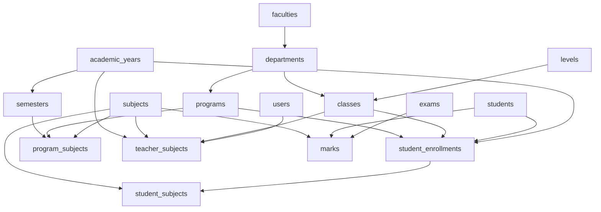

# Database Migrations Guide

## Overview

This document provides the complete set of Laravel migrations for the Academic Management System. These migrations create all 21 core tables with proper relationships, constraints, and indexes.

## Migration Files Structure

All migration files should be placed in `database/migrations/` directory and run in the following order:

### Core Structure Migrations (1-10)

1. `create_levels_table.php` - Educational levels
2. `create_faculties_table.php` - Academic faculties  
3. `create_departments_table.php` - Department structure
4. `create_classes_table.php` - Class definitions
5. `create_programs_table.php` - Academic programs
6. `create_academic_years_table.php` - Academic year management
7. `create_semesters_table.php` - Semester/term definitions
8. `create_subjects_table.php` - Subject catalog
9. `create_program_subjects_table.php` - Program-subject relationships
10. `create_grading_scales_table.php` - Grading system configuration

### User & Student Migrations (11-15)

11. `create_students_table.php` - Student information
12. `create_student_enrollments_table.php` - Yearly enrollments
13. `create_teacher_subjects_table.php` - Teacher assignments
14. `create_student_subjects_table.php` - Student-subject enrollment
15. `create_student_documents_table.php` - Document management

### Examination Migrations (16-17)

16. `create_exams_table.php` - Examination definitions
17. `create_marks_table.php` - Student marks

### System Migrations (18-21)

18. `create_mark_logs_table.php` - Mark change audit
19. `create_activity_log_table.php` - System activity logging
20. `create_institute_settings_table.php` - Institution configuration
21. `create_backups_table.php` - Backup management

## Key Migration Features

### Foreign Key Constraints
- Proper CASCADE and SET NULL relationships
- Referential integrity enforcement
- Orphaned record prevention

### Indexes for Performance
- Primary key indexes (automatic)
- Foreign key indexes
- Unique constraint indexes
- Custom performance indexes

### Data Validation
- Enum field constraints
- Unique constraints where needed
- Nullable field specifications
- Default value assignments

### Soft Deletes
- Enabled on students table
- Preserves historical data
- Allows data recovery

## Migration Execution

### Running Migrations

```bash
# Run all migrations
php artisan migrate

# Run with seed data
php artisan migrate --seed

# Check migration status
php artisan migrate:status

# Rollback last batch
php artisan migrate:rollback

# Reset all migrations
php artisan migrate:reset

# Fresh migration with seeding
php artisan migrate:fresh --seed
```

### Migration Dependencies

The migrations must be run in order due to foreign key dependencies:



## Critical Migration Notes

### 1. Unique Constraints

Several tables have important unique constraints:

```php
// Academic years must have unique names
$table->unique('name'); // academic_years

// Students must have unique admission numbers
$table->unique('admission_number'); // students

// Prevent duplicate enrollments
$table->unique(['student_id', 'academic_year_id']); // student_enrollments

// Prevent duplicate roll numbers per class/year
$table->unique(['class_id', 'academic_year_id', 'roll_no']); // student_enrollments

// Prevent duplicate marks
$table->unique(['student_id', 'subject_id', 'exam_id']); // marks
```

### 2. Enum Field Values

Important enum fields and their allowed values:

```php
// Gender options
$table->enum('gender', ['Male', 'Female', 'Other']);

// Student status options
$table->enum('status', ['active', 'inactive', 'graduated', 'transferred', 'dropped']);

// Academic standing options
$table->enum('academic_standing', ['good', 'probation', 'repeat', 'dismissed']);

// Exam types
$table->enum('exam_type', ['assessment', 'terminal', 'quiz', 'project', 'practical', 'final']);

// Result status workflow
$table->enum('result_status', [
    'draft', 'scheduled', 'ongoing', 'submitted', 'approved', 'published', 'locked'
]);

// Mark results
$table->enum('result', ['Pass', 'Fail', 'Incomplete']);
```

### 3. Computed Columns

The marks table includes a computed total column:

```php
$table->decimal('total', 5, 2)->storedAs(
    'COALESCE(assess_marks, 0) + COALESCE(theory_marks, 0) + COALESCE(practical_marks, 0)'
);
```

### 4. Soft Deletes

Only the students table uses soft deletes:

```php
$table->softDeletes(); // students table only
```

## Post-Migration Setup

### 1. Create Default Data

After running migrations, create essential default data:

```php
// Create default academic levels
Level::create(['name' => 'School', 'order' => 1]);
Level::create(['name' => 'College', 'order' => 2]);
Level::create(['name' => 'Bachelor', 'order' => 3]);

// Create default grading scale
GradingScale::create([
    'name' => 'Default School Grading',
    'pass_mark' => 40,
    'scale_type' => 'percentage',
    'grade' => 'A+',
    'min_percentage' => 90,
    'max_percentage' => 100,
    'gpa' => 4.00
]);
```

### 2. Create Admin User

```php
$admin = User::create([
    'name' => 'System Administrator',
    'email' => 'admin@school.edu.np',
    'password' => Hash::make('admin123'),
    'email_verified_at' => now()
]);

$admin->assignRole('admin');
```

### 3. Configure Institution Settings

```php
InstituteSettings::create([
    'school_name' => 'Your School Name',
    'address' => 'School Address',
    'phone' => '+977-1-1234567',
    'email' => 'info@school.edu.np',
    'principal_name' => 'Principal Name',
    'show_attendance' => false,
    'show_remarks' => true,
    'template_style' => 'modern',
    'enable_grace_marks' => true
]);
```

## Troubleshooting

### Common Migration Issues

1. **Foreign Key Constraint Errors**
   ```bash
   # Check if referenced table exists
   php artisan migrate:status
   
   # Run migrations in correct order
   php artisan migrate:rollback
   php artisan migrate
   ```

2. **Duplicate Entry Errors**
   ```bash
   # Clear existing data
   php artisan migrate:fresh
   
   # Or handle duplicates in seeder
   ```

3. **Column Length Issues**
   ```php
   // Ensure proper string lengths in migration
   $table->string('admission_number', 20)->unique();
   ```

### Database Optimization

After migration, optimize the database:

```sql
-- Analyze tables for optimization
ANALYZE TABLE students, marks, student_enrollments;

-- Check index usage
SHOW INDEX FROM marks;

-- Optimize tables
OPTIMIZE TABLE students, marks, student_enrollments;
```

## Backup Before Migration

Always backup before running migrations in production:

```bash
# Create database backup
mysqldump -u username -p database_name > backup_before_migration.sql

# Or use Laravel backup
php artisan backup:run --only-db
```

## Migration Rollback Plan

If migration fails, rollback procedure:

```bash
# Rollback last migration batch
php artisan migrate:rollback

# Rollback specific number of batches
php artisan migrate:rollback --step=5

# Complete rollback (use with caution)
php artisan migrate:reset
```

---

*These migrations provide a complete, production-ready database structure for the Academic Management System with proper relationships, constraints, and performance optimizations.*
